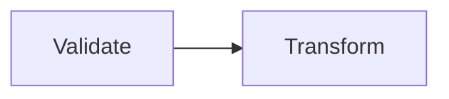
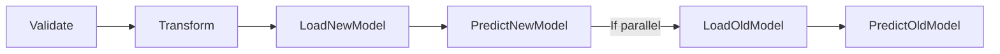

# Membership Telemarketing Prediction Workflow and Pipeline Design

This is a project that aim to design a workflow and pipeline of a predictive modeling of a campaign of a superstore
## Design
### Training Environment
Validate Trainsform Pipeline

### Production Environment
Predict Pipeline

## Schedule
Predict Pipeline: `12:00 AM Everyday`
## Architecture
All data and pipeline are run in databricks
## How to
Data Scientist

1. Run `Validate_Transform` Pipeline
2. Duplicating `Experinment` in the folder
3. Try out several techniques (loop)
4. MLFlow (Experiment) to compare each model
5. Export necessary model
6. Run `Predict` pipeline (adjust workflow parameter to be the name of the new model)
7. Check back everyday in the dashboard `Predict_New_Old` to compare the model after the officer are done with their work

Officer

1. Go to query `SELECT_CUSTOMER`
2. Start Working
3. Put down result of each call (0,1)

## Author
`
Lucas: ckaew099@uottawa.ca
`
`
Xinyi: xpan036@uottawa.ca
`